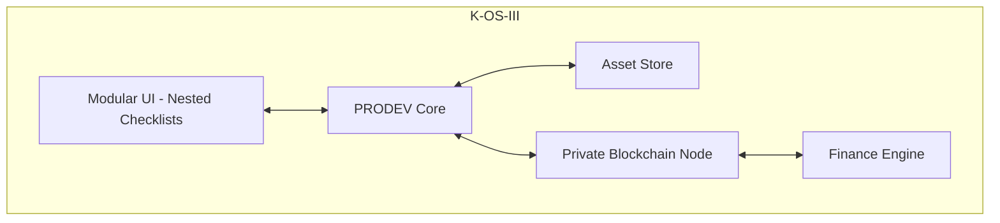

# PRODEV Architecture

## System Context
[Users] → PRODEV (K-OS-III) → Private Blockchain

## Container Diagram

```mermaid
graph TD
    subgraph "K-OS-III"
        UI[Modular UI - Nested Checklists]
        Core[PRODEV Core]
        Asset[Asset Store]
        BC[Private Blockchain Node]
        Finance[Finance Engine]
    end
    UI <--> Core
    Core <--> Asset
    Core <--> BC
    BC <--> Finance
```

Full details in your original prompt.